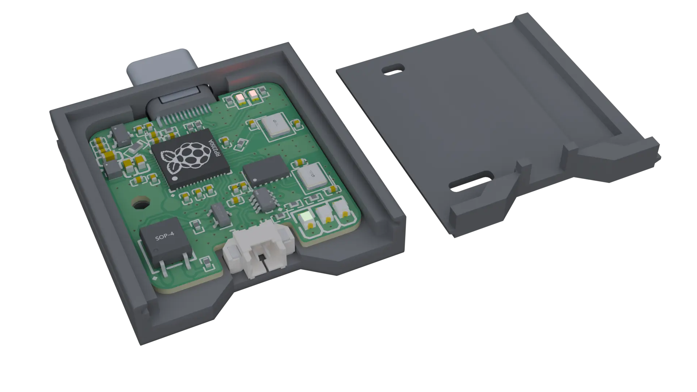

# USB CAN-FD Module

A compact, open-source USB-to-CAN FD adapter built around the **RP2354A** MCU and the
**Microchip MCP251xFD** CAN FD controller. Plug it into any machine over USB-C and get a
bus-powered, SocketCAN-compatible CAN / CAN FD interface — no external power needed.

> **Status:** Hardware complete. Firmware and the Linux SocketCAN driver are implemented
> and build cleanly, but are **not yet validated on real hardware**.

---

## Features

- CAN 2.0 A/B and CAN FD (up to 64-byte payloads, bit-rate switching)
- Native **SocketCAN** integration on Linux (`canX` interface, `can-utils`)
- Host-controlled bitrate, mode, bus-off restart, and on-board 120 Ω termination
- Transmit confirmation, bus-error reporting, and CRC-checked USB framing
- Bus-powered USB-C; per-device serial number from the chip UID

---

## How it works

```
  CAN bus ─── MCP251xFD ──SPI── RP2354A ──USB(bulk+control)── Host ── SocketCAN (canX)
                                  │
                core0: CAN/SPI   core1: USB (TinyUSB vendor class)
```

The firmware bridges the MCP251xFD to the host over a small CRC-framed USB vendor protocol
(core 0 drives CAN over SPI, core 1 drives USB; lock-free queues connect them). The Linux
kernel module presents that as a standard SocketCAN network device. The wire protocol is
defined once in [`src/common/usb_can_protocol.h`](src/common/usb_can_protocol.h) and shared
by both sides.

---

## Repository layout

```
src/
├── common/              # Shared USB wire protocol + CRC32 (firmware & host)
├── rp2354a_firmware/    # RP2354A firmware (C, Pico SDK)
└── drivers/
    └── lw_can_kmod/     # Linux SocketCAN kernel module
external/
└── lw_mcp251xfd/        # MCP251xFD driver library (git submodule)
docs/                    # Documentation (see firmware_todo.md)
schematics/              # PCB schematics (SVG + PDF)
```

---

## Building

Clone with submodules (the MCP251xFD library is a submodule):

```sh
git clone --recurse-submodules https://github.com/LeoTheWizard/usb_can_fd_module.git
cd usb_can_fd_module
# already cloned without submodules? — git submodule update --init
```

### Firmware (RP2354A)

Requires the [Pico SDK](https://github.com/raspberrypi/pico-sdk) (RP2350-capable), CMake ≥ 3.13,
and the `arm-none-eabi` GCC toolchain.

```sh
cmake -S src -B src/build -DPICO_SDK_PATH=/path/to/pico-sdk -DPICO_BOARD=pico2
cmake --build src/build
```

Output: `src/build/rp2354a_firmware/usb_can_fd_firmware.uf2`.

### Linux driver

Requires kernel headers for your running kernel (`linux-headers-$(uname -r)`), `make`, and GCC.

```sh
cd src/drivers/lw_can_kmod
make                      # -> build/lw_can.ko
```

---

## Usage

**1. Flash the firmware.** Hold `BOOTSEL`, plug the module into USB; it mounts as a mass-storage
device. Copy the UF2 onto it — the board reboots and runs the firmware:

```sh
cp src/build/rp2354a_firmware/usb_can_fd_firmware.uf2 /run/media/$USER/RP2350/
```

**2. Load the driver** (the dependency must be loaded first; `insmod` does not resolve it):

```sh
sudo modprobe can-dev can can-raw
sudo insmod src/drivers/lw_can_kmod/build/lw_can.ko
dmesg | tail            # expect: "lw_can registered (can0)"
```

**3. Bring up the interface and use it** with [`can-utils`](https://github.com/linux-can/can-utils):

```sh
# Classic CAN at 500 kbit/s
sudo ip link set can0 up type can bitrate 500000

# …or CAN FD: 500 kbit/s arbitration, 2 Mbit/s data phase
sudo ip link set can0 up type can bitrate 500000 dbitrate 2000000 fd on

candump can0                    # receive
cansend can0 123#DEADBEEF       # send a classic frame
cansend can0 123##1112233       # send an FD frame (BRS)

sudo ip link set can0 down      # when finished
```

After a bus-off, recover with `sudo ip link set can0 type can restart`, or add
`restart-ms 100` at link-up for automatic recovery.

---

## Hardware

| Component | Details |
|-----------|---------|
| MCU | Raspberry Pi RP2354A (RP2350 family, dual Arm Cortex-M33) |
| CAN FD controller | Microchip MCP251xFD (SPI) |
| Host interface | USB-C — bus-powered |
| CAN connector | 2-pin PicoBlade (CAN H / CAN L), switchable 120 Ω termination |

Schematics: [MCU](schematics/SVGs/SCH_Schematic1_1_2-MCU_2026-06-01.svg) ·
[CAN FD](schematics/SVGs/SCH_Schematic1_1_3-CAN_FD_2026-06-01.svg) ·
[Power](schematics/SVGs/SCH_Schematic1_1_5-Power_2026-06-01.svg) ·
[Interfaces](schematics/SVGs/SCH_Schematic1_1_4-Interfaces_2026-06-01.svg) ·
[full PDF](schematics/pcb_schematic_r1.1.pdf)

---

## License

[MIT](LICENSE) — © Leo Walker, 2025
